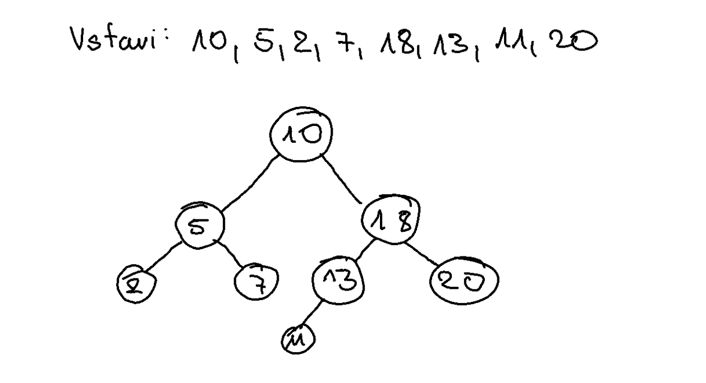

# Binarno Iskalno Drevo - Binary Search Tree

## Dvojiško drevo

Dvojišjko drevo, je bodisi prazno ali sestavljeno iz korena. 

Koren ima levo lai desno poddrevo, ki sta prav tako dvojiški drevesi.

## Urejenost potomcev

Levo poddrevo nekega vozlišča vsebuje samo vozlišča z manjsko vrednostjo od korena, desno poddrevo pa samo vozlišča z večjo vrednostjo od korena.

Levo in desno poddrevo sta spet dvojiški iskalni drevesi.

## Pregled drevesa

Želimo obiskat vozlišča drevesa

### Breadth First Search in Depth First Search

#### BFS

Pregled v širino

#### DFS

Pregled v globino

##### Obratni vrstni red (2,7,5,11,13,20)
Obišči levo poddrevo, obišči desno poddrevo, obišči vozlišče

##### Umesni vrstni red (10,5,2,7,18,13,11,20)
Obišči vozlišče, obišči levo poddrevo, obišči desno poddrevo

##### Premi vrstni red (2,5,7,10,11,13,18,20)
Obišči levo poddrevo, vozlišče, obišči desno poddrevo

## Slike

