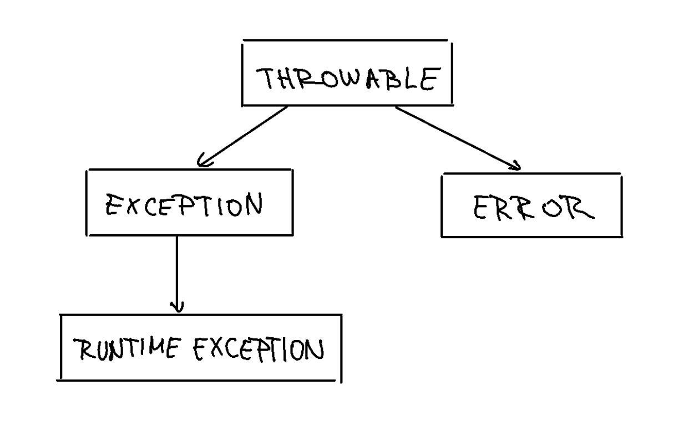

# Izjeme - Exceptions

Izredno stanje, ki se pojavi med izvajanjem programa.

Java code shematics:

```java
try {
    // code that can throw an exception
} catch (ExceptionType1 e1) {
    // code that handles ExceptionType1
} catch (ExceptionType2 e2) {
    // code that handles ExceptionType2
} finally {
    // code that is always executed
}
```

Throws exceptions se zgodijo v metodi, ki jo kličemo. Metoda, ki jo kličemo, mora imeti throws deklaracijo, da vrne izjemo.

Runtime expection catcha vse runtime izjeme.


## Slike

Slika 1: Shema izjem
