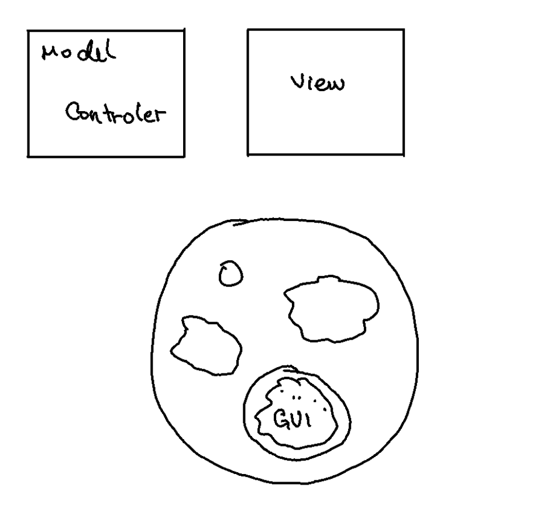
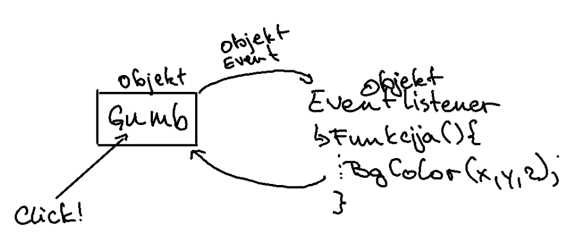

# Izjeme - Exceptions
# GUI - Grafični uporabniški vmesnik

## AWT - Abstract Window Toolkit

### Swing

Swing gradi na AWT:

- Javanske komponente
- Pluggable look and feel

#### Okno
- Top level container
- Frame, dialog, applet

#### Komponenta
- GUI widget prikazan v oknu
- Gumb, labels

#### Container
- Logična skupina komponente
- Panel

## Slike

Slika 1: Slika Amebe :)

Slika 2: Shema Gumba
