# Grafi
- Množica elementov povezanih s povezavami
- Vsak element je vozlišče

## Neusmerjen Graf
Ne definira smeri povezav --> Relacija med vozliščema je simetrična

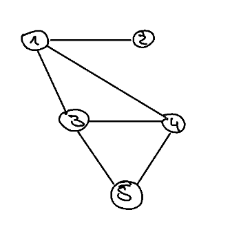
Množica vozlišč z binarno relacijo sosednosti

Graf G je definiran kot G = (V, E)

U = {1, 2, 3, 4, 5} -> Množica vozlišč

E ⊆ {(u, v) | u, v € U} 
E = {(1,2), (1,3), (1,4), (3,4), (3,5), (4,5)} -> Množica povezav

## Usmerjen Graf

Razlika z neusmerjenim grafom je v tem, da je relacija med vozliščema usmerjena.

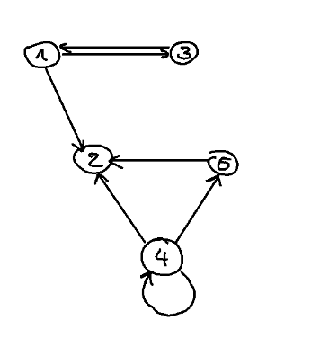
U = {1, 2, 3, 4, 5} -> Množica vozlišč

E ⊆ {(u, v) | u, v € U} 
E = {(1,2), (1,3), (3,1), (5,2), (4,5), (4,2), (4,4)} -> Množica povezav

## Posebni tipi grafov
### Povezan seznam
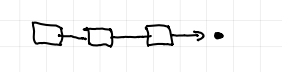
### Drevo
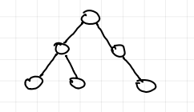

## Sosednjost
- Dva vozlišča sta soseda, če sta povezana

## Pot v grafu
- Zaporedje vozlišč v grafu, ki poveže dve vozlišči 

Pot (1,4) =
= [1,5,6,4] =
= [1,2,3,5,4] =
= [1,5,4]

Nastane cikel [1,2,3,5]
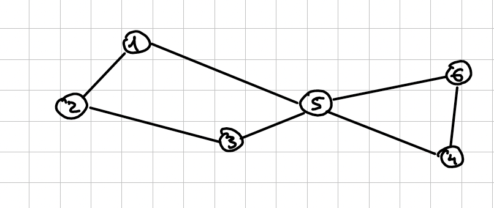

## Polni usmerjen graf
Je graf, kjer je vsako vozlišče povezano z vsakih vozliščem
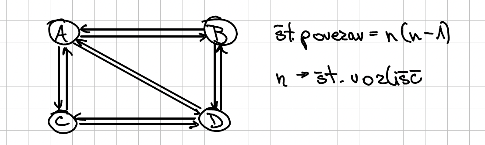

## Polni neusmerjen graf
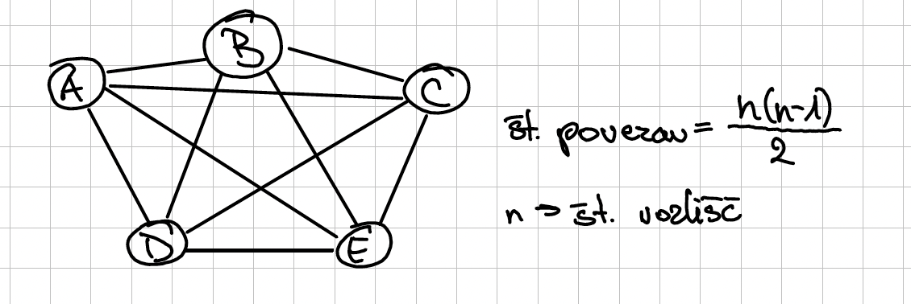

## Utežni graf
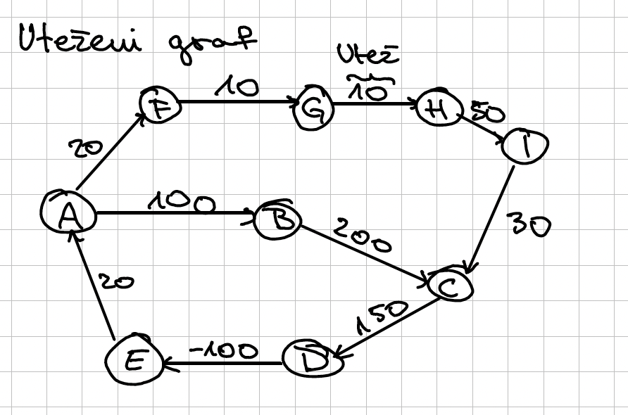

# Implementacija grafov

## Konceptualni graf
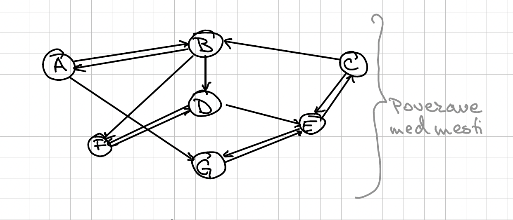

## Matrika sosednosti - adjecency matrix
Graf je predstavjen z 1D poljem vozlisc in 2D poljem povezav
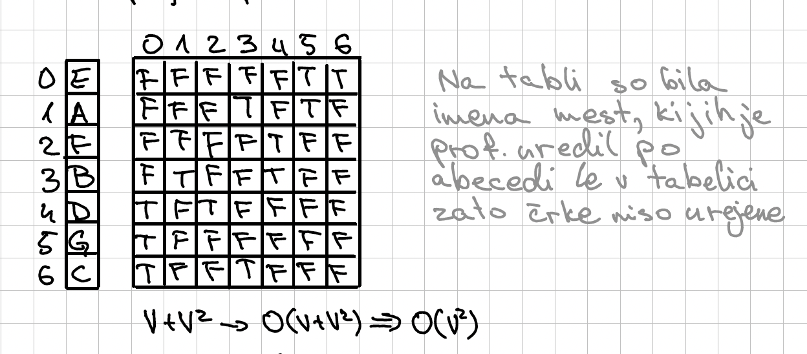

## Seznam sosednosti - adjecency list
Graf predstaviomo z 1D poljem, ki predstavlja vozlišča, kjer vsako vozlišče vsebuje seznam sosedov
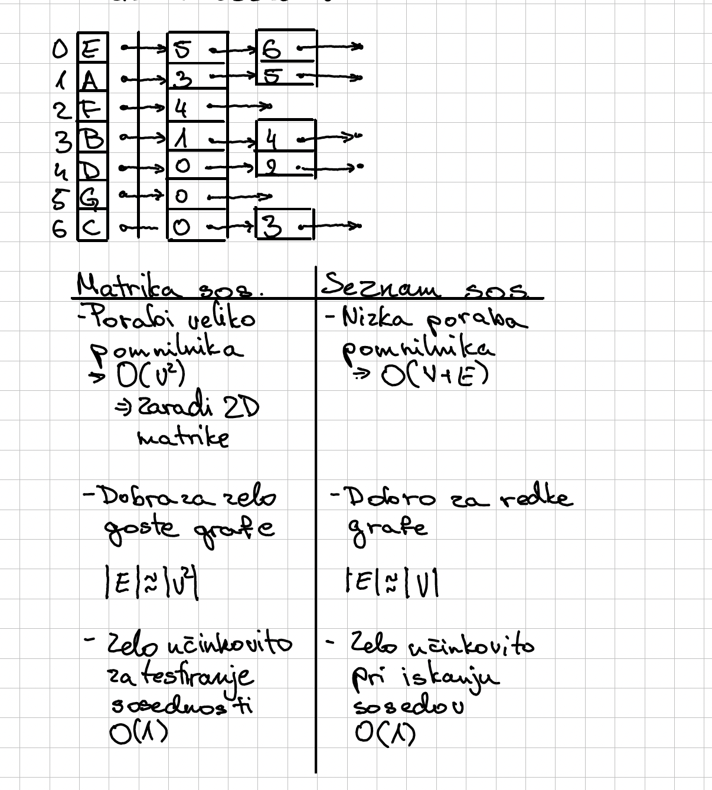

## Iskanje poti v grafu
- Iščemo pot med dvema vozliščema

Primer: Obstaja pot med B in G

To rešimo z uporabo "DFS-dept first search" in "BFS-breath first search" aka DFS-iskanje v globino, BFS-iskanje v širino. 
